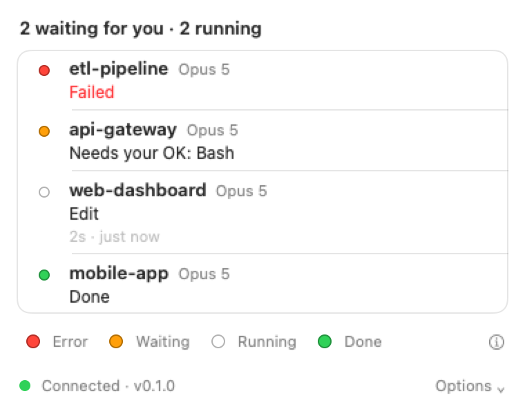
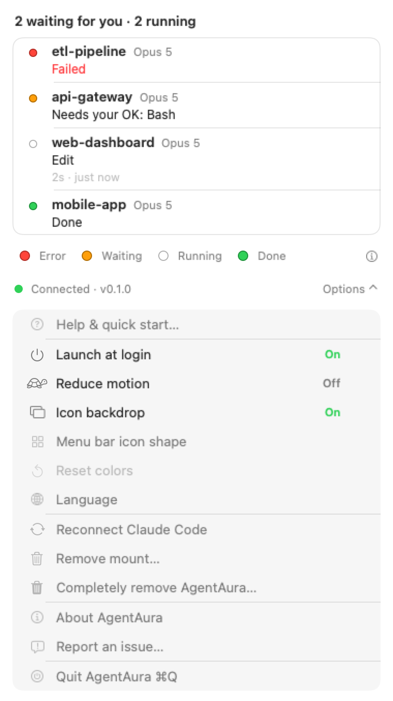

<h1 align="center">AgentAura</h1>

<p align="center">
  <b>See what your Claude Code sessions are doing, from the menu bar.</b><br>
  One light for all of them. Only the states that need you ever move.
</p>

<p align="center">
  English · <a href="README.zh-TW.md">繁體中文</a>
</p>

<p align="center">
  
</p>

<p align="center">
  <sub><code>idle</code>, <code>working</code> and <code>done</code> hold still. Only <code>waiting</code> and <code>error</code> move.</sub>
</p>

---

## What it's for

Run several Claude Code sessions at once and your screen stops telling you anything useful.

Which one is waiting on a permission prompt? Which one died twenty minutes ago? Which one
finished while you were in another window? Right now you find out by clicking through
terminal tabs.

AgentAura puts one light in your menu bar for all of your sessions. Click it and you get a
panel listing each session on its own. You glance up instead of hunting.

## One rule: only what needs you moves

An indicator that animates all the time is just a second thing competing for your attention.
So movement is rationed. It is spent where it buys something and nowhere else.

| State | Look | Movement |
|---|---|---|
| `idle` | Almost invisible | None |
| `working` | Dim and low contrast | A 4-second breath, barely there |
| `done` | Steady green | **None.** You can look when you want |
| `waiting` | Amber | A clear 1.1-second pulse |
| `error` | Red | Double blink |

The single light shows the most urgent state across all your sessions:
`error > waiting > working > done > idle`.

Priority wins, not recency. If a subagent finishes a tool call one moment after the main agent
asks you for permission, the light must keep saying "waiting". Getting this wrong was the
first real bug the project found, and it is the one thing the product cannot afford to get
wrong.

## The panel

One row per session: project name, what it's doing, and how long the current tool has been
running.

<p align="center">
  <picture>
    <source media="(prefers-color-scheme: dark)" srcset="docs/readme/panel-dark.png">
    
  </picture>
</p>

The four coloured dots along the bottom are buttons. Click one to open the system colour
picker and recolour that state. The menu bar icon updates live as you drag, and your colours
are remembered.

<details>
<summary><b>Everything else is in the Options menu</b> (click to expand)</summary>

<p align="center">
  <picture>
    <source media="(prefers-color-scheme: dark)" srcset="docs/readme/panel-options-dark.png">
    
  </picture>
</p>

Launch at login · Reduce motion · Icon backdrop · Menu bar icon shape · Reset colours ·
Language (English / 繁體中文) · Reconnect · Remove mount · Completely remove AgentAura ·
About · Report an issue · Quit

Reduce motion is combined with your system setting, so turning it on in macOS is enough.
Right-clicking the menu bar icon opens this menu directly.
</details>

## Icon shapes

Six to choose from. The LED strip is the default. The other five are SF Symbols.

<p align="center">
  
</p>

The picker shows each shape as a live thumbnail, animated in your current state. The
thumbnails are drawn by the same code that draws the real icon, so they can't drift away from
what you'll actually get.

## Install

One command, about five seconds. It downloads the published build, checks it against its
published checksum, installs it into Applications and opens it.

```bash
curl -fsSL https://raw.githubusercontent.com/kbsiy0/AgentAura/main/scripts/install.sh | bash
```

Piping a script into your shell means running code you haven't read. It's about 170 lines and
you can [read it first](scripts/install.sh). Two things in it are worth knowing before you
run it, and they're stated in its own output too:

- It **clears the quarantine flag** on the downloaded app. That's what makes this one step
  instead of a trip through System Settings — and it's a real trade. You're trusting the
  checksum and this script rather than Gatekeeper.
- If there's no published build, or the download fails, it **builds from source instead**
  (about 30 seconds, needs the Swift toolchain). `--from-source` forces that path.

You need **macOS 13 or later** and **Claude Code**. The toolchain is only needed if you
build from source.

<details>
<summary>Prefer to clone first?</summary>

```bash
git clone https://github.com/kbsiy0/AgentAura.git && cd AgentAura && ./scripts/install.sh
```

Same script, same result. The reading step is just harder to skip.
</details>

Then two things, both in the app:

1. Click **Connect**.
2. Start a **new** Claude Code session.

> **The next session, not the one you have open.** Claude Code loads plugins when a session
> starts. A window that is already running won't pick one up part-way through. The app says so
> rather than pretending it works right away.

<details>
<summary>Prefer to do it by hand?</summary>

```bash
./scripts/build-plugin.sh      # builds the aura-hook binary
./scripts/build-app.sh         # produces build/AgentAura.app
```

Then drag `build/AgentAura.app` into Applications and open it. Don't leave it in `build/` or
Downloads — apps in those places get moved or cleaned up, and the mount breaks.
</details>

To uninstall, use Options → *Remove mount* to unhook it, or Options → *Completely remove
AgentAura* to put the machine back how it was. `./scripts/verify-uninstall.sh` checks that
second claim one item at a time.

Full instructions, uninstall details and troubleshooting: [`docs/INSTALL.md`](docs/INSTALL.md).

## What it does to your Mac

Fair questions to ask about anything that watches you work. Short answers first.

- **It never connects to the internet.** No telemetry, no update check, no crash reports.
- **It writes two things:** session state in `~/.agentaura/`, and one symlink at
  `~/.claude/skills/agentaura`.
- **It never touches `~/.claude/settings.json`.** Not one byte, ever.
- **It doesn't read your work.** Not your transcripts, not your prompts, not your code.
- **It runs one binary:** `aura-hook`, to check the hook actually works. It clears that
  file's quarantine flag first.
- **It asks for no macOS permissions,** but it is not sandboxed, and it is not notarized.
- **It has no third-party dependencies.** The binary you run is one you built yourself.

<details>
<summary><b>The precise version</b> — every line below was checked against the source</summary>

**Network.** The app opens no connections of its own. There is no HTTP client in the
codebase. Two URLs exist in the source, for the repository and *Report an issue*. Clicking
those hands a URL to your browser.

**Writes.**
- `~/.agentaura/sessions/` — the directory, `0700`
- `<session-id>.json` inside it — `0600`, re-tightened on every write
- the symlink `~/.claude/skills/agentaura`, creating `~/.claude/skills/` if that level is
  missing
- `$TMPDIR/aura-verify-<uuid>/` during verification, deleted afterwards
- `~/.agentaura-uninstall.log`, only if uninstall can't reach the Trash

**Deletes.** Its own state files as sessions end. *Completely remove* also clears the
`io.agentaura.app` preferences, deletes `~/.agentaura`, and moves the app to the Trash. That
last one is recoverable until you empty the Trash.

**Reads.** Its own state files, its own preferences, and the help page inside its own bundle.
It also inspects its own mount point with `lstat` and `readlink`, and `stat`s the two files
underneath it. It does not read your transcripts, prompts or code.

**Runs.** Exactly one executable: `~/.claude/skills/agentaura/bin/aura-hook`, to confirm the
hook works. **It removes that file's `com.apple.quarantine` attribute first**, because a
quarantined binary gets SIGKILLed instead of failing visibly. It runs with no arguments, not
through a shell, with self-generated JSON on stdin and its output discarded. If you point the
mount somewhere by hand, that is the binary this will un-quarantine and run.

**`~/.claude/settings.json`.** Never written. A test asserts the file is byte-identical
before and after connecting, and that the only change anywhere under `~/.claude` is
`{skills, skills/agentaura}`. If `~/.claude` doesn't exist, connecting is refused rather than
creating it.

**Permissions.** No macOS privacy permissions are requested — no screen recording,
accessibility, automation or full disk access. `Info.plist` contains zero usage descriptions.
The other side of that: the app is **not sandboxed and ships no entitlements**, because it has
to write `~/.claude` and `~/.agentaura`. It runs with your account's ordinary file access.
*Launch at login* is off by default and uses `SMAppService`.

**Signing.** Ad-hoc signed, **not notarized**. macOS 15 removed the right-click → Open
bypass, so the first launch needs *System Settings → Privacy & Security → Open Anyway*.

**Dependencies.** None. `Package.swift` has no `.package(url:)` and there is no
`Package.resolved`. `plugin/bin/aura-hook` is not in version control, so the binary you run is
one you built from this source.

**Trust boundary.** Installing the plugin lets Claude Code run `plugin/bin/aura-hook` on 19
hook events. Clicking **Connect** always mounts the copy inside the app bundle. Running
`ln -sfn` yourself, to point the mount at someone else's directory, is a different decision:
it authorises their code, and the verification step above will clear its quarantine flag.

**What the hook receives.** Metadata: session id, project directory name, event type, tool
name, timing. AgentAura keeps a reduced copy on disk so the panel can be redrawn, and deletes
it when you uninstall.
</details>

## How it works

```
Claude Code plugin hooks (19 events, all async)
        │
        ▼
aura-hook ──read-merge-write under flock──▶ ~/.agentaura/sessions/<id>.json
                                                  │ FSEvents
                                                  ▼
                                          PipelineGraph
                                          ├─ menu bar icon + animation
                                          └─ SwiftUI panel
```

Four modules. `AuraCore` holds the pure logic and imports no UI at all, which a
compiler-driven test enforces. `AuraHookFile` does files and FSEvents. `aura-hook` is the
command-line tool Claude Code calls. `AgentAuraApp` is the interface.

`aura-hook` always exits 0 and never prints anything, whatever happens. A tool that watches
your agent must never interfere with it. The price is that exit codes tell you nothing, so
every check in this project looks at the file that was written instead.

## The contract came from measurement, not the docs

It was written against **141 real hook payloads**, captured over three rounds. Measuring
overturned several things the documentation implied, and caught three bugs that reading could
not have.

**Subagents share the parent's session id.** Main and subagent events interleaved five times
in a single session, 20 ms apart at the closest. With last-write-wins, a subagent's
`PostToolUse` overwrites the main agent's `PermissionRequest` within 20 ms. That silently
erases the most important signal the product has. Fixed by giving main and subagent separate
slots and taking the highest priority.

**Denying a permission prompt produces no event at all.** The sequence is
`PermissionRequest`, then you press Deny, then nothing, then `SessionEnd`. So `waiting` must
never survive into the "ended but unacknowledged" tail. Otherwise a session you already
answered keeps the icon amber forever.

**The error field is called `error`, not `tool_error`.** The first conclusion written into the
spec was that there was no error field at all. The payloads were being inspected through a
hand-written key filter, and that filter didn't contain the real field name. Looking at data
through your own assumptions only shows you your assumptions.

The method corrects itself too. Round one concluded that no event carries `model`; round two
disproved it. Both rounds stay in the spec, along with the reasoning for the reversal.

> The fixtures in `Tests/AuraCoreTests/Fixtures/` are **de-identified**. Paths, prompts,
> messages and file contents were replaced before this repository was made public. The event
> structure is untouched, which is what the contract and its tests actually depend on. The raw
> captures are not published.

## Documentation

| Document | What's in it |
|---|---|
| [`docs/INSTALL.md`](docs/INSTALL.md) | Install, uninstall, troubleshooting, upgrading |
| [`docs/superpowers/specs/2026-09-08-agentaura-design.md`](docs/superpowers/specs/2026-09-08-agentaura-design.md) | The canonical design. Where documents disagree, this one wins |
| [`docs/2026-09-09-agentaura-audit.html`](docs/2026-09-09-agentaura-audit.html) | Eight families of tests that guarded nothing, and their fixes |
| [`docs/2026-09-11-subagent-state-priority-audit.html`](docs/2026-09-11-subagent-state-priority-audit.html) | How background subagents made the light lie, with the measured timeline |
| [`CLAUDE.md`](CLAUDE.md) | Project instructions for Claude Code: each rule with the failure that produced it |
| [`CONTRIBUTING.md`](CONTRIBUTING.md) | How to get set up, and the conventions that will surprise you |
| [`SECURITY.md`](SECURITY.md) | What the tool can do on your machine, what's enforced by tests, and the known weaknesses |

The HTML files open straight from disk. Nothing needs an account.

## Development

```bash
swift test                         # everything
swift test --filter <test name>    # one test, by function name
```

760 tests across 144 suites. Swift 6 with strict concurrency. Tests use
[swift-testing](https://github.com/swiftlang/swift-testing), not XCTest.

A fresh clone needs `./scripts/build-plugin.sh` first. `plugin/bin/aura-hook` is a build
product and isn't in version control, so three install-layout tests fail without it.

The images in this README are generated, not screenshotted:

```bash
AURA_RENDER_README=1 swift test --filter ReadmeAssetRenderer
```

They render the real views offscreen. That keeps them reproducible, and keeps real project
names and paths out of a public repository.

The testing approach is written up in [`CLAUDE.md`](CLAUDE.md), together with the mistake
that produced each rule. Three ideas run through it. Ask the platform instead of
approximating it. Derive every number from types or from disk, never freeze it as a constant.
And prove that each test can actually fail.

## Contributing

Bug reports and small fixes are welcome. [`CONTRIBUTING.md`](CONTRIBUTING.md) covers the setup
and the conventions worth knowing first — the file size limits, the fact that tests use
swift-testing rather than XCTest, and why a test nobody has watched fail doesn't count.

For anything security-related, please use the private route in [`SECURITY.md`](SECURITY.md)
rather than a public issue.

## License

[MIT](LICENSE)
