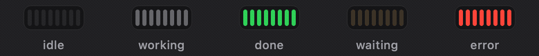
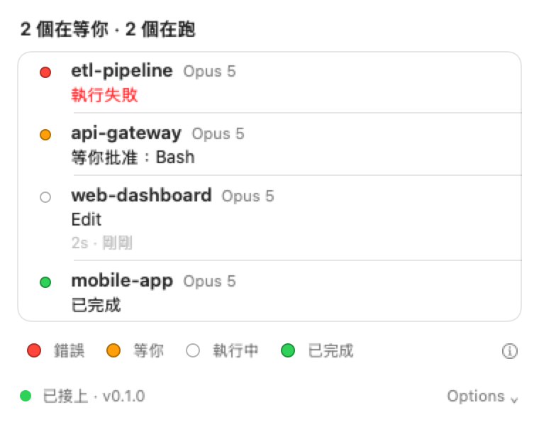
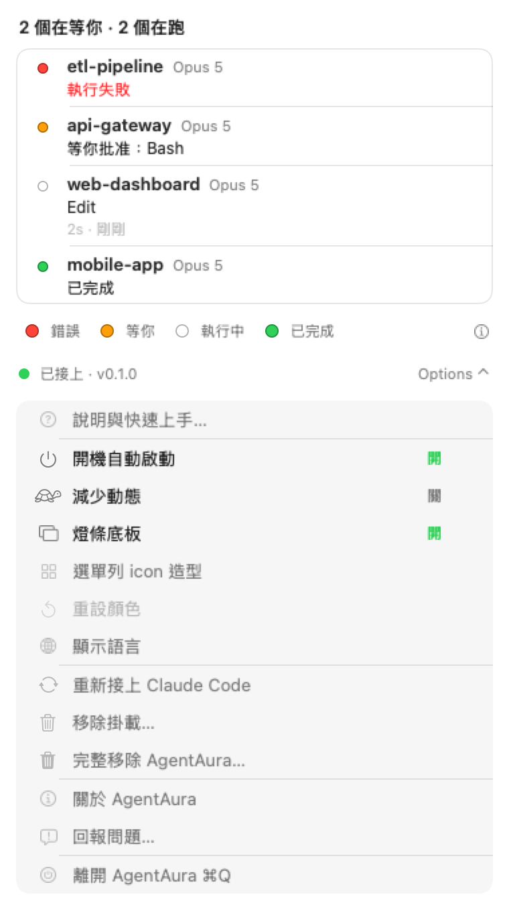
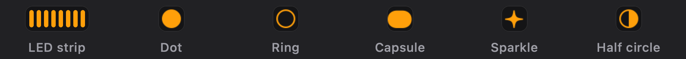

<h1 align="center">AgentAura</h1>

<p align="center">
  <b>在選單列上看見你的 Claude Code session 正在做什麼。</b><br>
  全部 session 一顆燈。只有需要你的狀態才會動。
</p>

<p align="center">
  <a href="README.md">English</a> · 繁體中文
</p>

<p align="center">
  
</p>

<p align="center">
  <sub><code>idle</code>、<code>working</code>、<code>done</code> 完全靜止，只有 <code>waiting</code> 與 <code>error</code> 會動。</sub>
</p>

---

## 這是做什麼的

同時開好幾個 Claude Code session 之後，畫面就不再告訴你任何有用的事。

哪一個在等你批權限？哪一個二十分鐘前就掛了？哪一個在你切到別的視窗時跑完了？
現在你只能一個一個切終端機分頁去看。

AgentAura 在選單列放一顆燈，代表你全部的 session。點開它會列出每一個 session 的細節。
抬頭看一眼就好，不必翻。

## 唯一的規則：只有需要你的才會動

一個一直在動的指示器，只是第二個跟你搶注意力的東西。所以動畫是配額制的，
只花在真的買得到東西的地方。

| 狀態 | 呈現 | 動畫 |
|---|---|---|
| `idle` | 幾乎看不見 | 無 |
| `working` | 暗、低對比 | 4 秒一次的呼吸，幾乎察覺不到 |
| `done` | 恆亮綠 | **無。** 你想看的時候再看 |
| `waiting` | 橘色 | 明顯的 1.1 秒脈動 |
| `error` | 紅色 | 雙閃 |

那顆燈顯示的是你全部 session 裡**最急的**那個狀態：
`error > waiting > working > done > idle`。

**比的是優先序，不是誰最後寫入。** 如果 subagent 在主 agent 跟你要權限的下一刻結束了
一次工具呼叫，燈必須繼續說「等你」。這件事做錯過一次，是這個專案抓到的第一個真 bug，
也是這個產品最不能錯的一件事。

## 面板

一列一個 session：專案名稱、正在做什麼、當前工具跑了多久。

<p align="center">
  <picture>
    <source media="(prefers-color-scheme: dark)" srcset="docs/readme/panel-zh-dark.png">
    
  </picture>
</p>

底部那四個色點是按鈕。點下去會開系統色板，拖色時選單列的燈即時跟著變，顏色會被記住。

<details>
<summary><b>其餘功能都在 Options 選單裡</b>（點開）</summary>

<p align="center">
  <picture>
    <source media="(prefers-color-scheme: dark)" srcset="docs/readme/panel-options-zh-dark.png">
    
  </picture>
</p>

開機自動啟動 · 減少動態 · 燈條底板 · 選單列 icon 造型 · 重設顏色 ·
語言（English／繁體中文）· 重新接上 · 移除掛載 · 完整移除 AgentAura ·
關於 · 回報問題 · 離開

「減少動態」會跟你的系統設定合併，所以在 macOS 裡開起來就夠了。
**右鍵**點選單列 icon 會直接開這個選單。

</details>

## Icon 造型

六種可選。LED 燈條是預設，其餘五種是 SF Symbol。

<p align="center">
  
</p>

選單裡每一項都是會動的縮圖，照你當前的狀態。縮圖是由畫真正那顆 icon 的同一份程式畫出來的，
所以不可能跟你實際拿到的樣子漂開。

## 安裝

需要 macOS 13 以上、Claude Code，以及 Swift 6 工具鏈（`xcode-select --install`）。
目前還沒有現成的下載版本。

```bash
git clone https://github.com/kbsiy0/AgentAura.git && cd AgentAura
./scripts/build-plugin.sh      # 建置 aura-hook 執行檔
./scripts/build-app.sh         # 產出 build/AgentAura.app
```

然後把 `build/AgentAura.app` 拖進「應用程式」、打開它、按**接上**，
再**開一個新的 Claude Code session**。

> **是下一個 session，不是你現在開著的那個。** Claude Code 在 session 啟動時載入 plugin，
> 已經在跑的視窗不會中途載入。App 會照實這樣說，不會假裝立刻生效。

要移除：Options →「移除掛載」解除掛載，或 Options →「完整移除 AgentAura」讓機器回到
安裝前的狀態。`./scripts/verify-uninstall.sh` 會逐項驗證後面那個宣稱。

完整步驟、移除細節與疑難排解：[`docs/INSTALL.zh-TW.md`](docs/INSTALL.zh-TW.md)。

## 它會對你的 Mac 做什麼

裝一個會看著你工作的東西之前，這些都該問。先給短答案。

- **它從不連網。** 沒有遙測、沒有更新檢查、沒有當機回報。
- **它只寫兩個東西：** `~/.agentaura/` 底下的 session 狀態，以及一條
  `~/.claude/skills/agentaura` symlink。
- **它從不碰 `~/.claude/settings.json`。** 一個位元組都沒有。
- **它不讀你的工作內容。** 不讀 transcript、不讀 prompt、不讀你的程式碼。
- **它會執行一個東西：** `aura-hook`，用來確認 hook 真的能動。執行前會先清掉那個檔的隔離標記。
- **它不要求任何 macOS 權限**，但它沒有沙箱化，也沒有經過 Apple 公證。
- **它沒有任何第三方相依。** 你跑的那顆執行檔是你自己建的。

<details>
<summary><b>精確版</b>——下面每一條都是對照原始碼查過的</summary>

**網路。** App 自己不開任何連線，整個 codebase 裡沒有 HTTP client。原始碼裡有兩個 URL：
專案位址與「回報問題」，點下去是把網址交給你的瀏覽器。

**寫入。**
- `~/.agentaura/sessions/` 這個目錄本身（`0700`）
- 底下的 `<session-id>.json`（`0600`，每次寫入重新收緊）
- symlink `~/.claude/skills/agentaura`，若 `~/.claude/skills/` 這一層不存在會建立它
- 驗證期間的 `$TMPDIR/aura-verify-<uuid>/`，用完即刪
- `~/.agentaura-uninstall.log`，只在移除時丟不進垃圾桶才寫

**刪除。** session 結束後刪自己的狀態檔。「完整移除」另外會清掉 `io.agentaura.app` 偏好、
刪掉 `~/.agentaura`、把 App 移到垃圾桶。最後那項在你清空垃圾桶之前都還原得回來。

**讀取。** 自己的狀態檔、自己的偏好、自己 bundle 裡的說明頁。另外會用 `lstat` 與 `readlink`
檢查自己的掛載點，並 `stat` 它底下那兩個檔。不讀你的 transcript、prompt 或程式碼。

**執行。** 從頭到尾只有一個：`~/.claude/skills/agentaura/bin/aura-hook`，用來確認 hook 能動。
**執行前會先移除那個檔的 `com.apple.quarantine` 屬性**，因為帶隔離的執行檔會被 SIGKILL，
而不是明確地失敗。執行時不帶參數、不經 shell、stdin 餵自產的 JSON、輸出丟棄。
如果你自己把掛載指到別的地方，那就是它會去拆隔離並執行的那顆檔案。

**`~/.claude/settings.json`。** 從沒被寫過。有測試斷言接上前後它位元組完全相同，
且整個 `~/.claude` 底下唯一的差異是 `{skills, skills/agentaura}`。
`~/.claude` 不存在時**拒絕接上**，不會去建立它。

**權限。** 不要求任何 macOS 隱私權限——不要螢幕錄製、輔助使用、自動化或完整磁碟取用，
`Info.plist` 裡零個用途說明。反面也要講：這個 App **沒有沙箱化、也沒有任何 entitlement**，
因為它必須寫 `~/.claude` 與 `~/.agentaura`，所以它有你帳號層級的一般檔案存取能力。
「開機自動啟動」預設關閉，走系統的 `SMAppService`。

**簽章。** ad-hoc 簽章，**未經公證**。macOS 15 移除了右鍵→開啟的繞道，
所以第一次開啟要走**系統設定 → 隱私權與安全性 → 強制打開**。

**相依。** 零。`Package.swift` 沒有任何 `.package(url:)`，也沒有 `Package.resolved`。
`plugin/bin/aura-hook` 不進版控，所以你跑的執行檔是你自己從這份原始碼建出來的。

**信任邊界。** 安裝這個 plugin 等於允許 Claude Code 在 19 個 hook 事件上執行
`plugin/bin/aura-hook`。按**接上**掛的永遠是 App bundle 內建的那一份。
自己用 `ln -sfn` 把掛載指到別人的目錄是另一個決定：那等於授權執行那份程式碼，
而上面那個驗證步驟還會替它清掉隔離標記。

**hook 收到什麼。** 中繼資料：session id、專案目錄名、事件類型、工具名稱、時間。
AgentAura 把其中一份精簡版存到磁碟好讓面板能重畫，移除時一併刪掉。

</details>

## 運作方式

```
Claude Code plugin hooks（19 個事件，全部 async）
        │
        ▼
aura-hook ──flock 下 read-merge-write──▶ ~/.agentaura/sessions/<id>.json
                                                │ FSEvents
                                                ▼
                                        PipelineGraph
                                        ├─ 選單列 icon ＋ 動畫
                                        └─ SwiftUI 面板
```

四個 module。`AuraCore` 是純邏輯，完全不 import 任何 UI，由編譯器驅動的測試強制。
`AuraHookFile` 負責檔案與 FSEvents。`aura-hook` 是 Claude Code 呼叫的命令列工具。
`AgentAuraApp` 是介面。

`aura-hook` **不論發生什麼都 exit 0，而且什麼都不印。** 一個看著你的 agent 的工具，
絕不可以干擾它。代價是 exit code 完全不能用來判斷成敗，所以這個專案的每一項驗證，
看的都是它寫出來的那個檔案。

## 契約來自實測，不是文件

它是照 **141 個真實 hook payload** 寫的，分三輪捕獲。實測推翻了文件暗示的多件事，
也抓到三個純讀文件抓不到的 bug。

**subagent 與父 session 共用 session id。** 一個 session 裡主／subagent 事件交錯五次，
最密的相鄰只差 20 毫秒。在 last-write-wins 之下，subagent 的 `PostToolUse` 會在 20 毫秒內
覆寫掉主 agent 的 `PermissionRequest`，把這個產品最重要的訊號靜默抹除。
修法是主／副分槽、取優先序最高的那個。

**按下 Deny 不會產生任何事件。** 序列是 `PermissionRequest`、你按 Deny、什麼都沒有、
`SessionEnd`。所以 `waiting` 絕不能存活到「已結束但未確認」的尾巴，
否則一個你早就回答過的 session 會讓 icon 一直亮著橘燈。

**錯誤欄位叫 `error`，不叫 `tool_error`。** 最初寫進 spec 的結論是「它根本沒有錯誤欄位」。
當時是透過一份自己寫的 key 過濾器去看 payload，而那份過濾器裡沒有真正的欄位名。
用自己的假設去觀察，只會看到自己的假設。

這個方法也會自我修正。第一輪的結論是「任何事件都不帶 `model`」，第二輪推翻了它。
兩輪的紀錄與翻案的判準都留在 spec 裡。

> `Tests/AuraCoreTests/Fixtures/` 裡的 payload 已經**去識別化**：路徑、prompt、訊息與
> 檔案內容在 repo 公開前都被換掉了。事件的結構原封不動，那才是契約與它的測試真正
> 依賴的東西。原始捕獲則不公開。

## 文件

| 文件 | 內容 |
|---|---|
| [`docs/INSTALL.zh-TW.md`](docs/INSTALL.zh-TW.md) | 安裝、移除、疑難排解、升級 |
| [`docs/superpowers/specs/2026-09-08-agentaura-design.md`](docs/superpowers/specs/2026-09-08-agentaura-design.md) | 正典設計。與其他文件衝突時以它為準 |
| [`docs/2026-09-09-agentaura-audit.html`](docs/2026-09-09-agentaura-audit.html) | 八族「空轉的守衛」實證案例與修法 |
| [`docs/2026-09-11-subagent-state-priority-audit.html`](docs/2026-09-11-subagent-state-priority-audit.html) | 背景 subagent 怎麼讓燈號說謊，以及實測的時間線 |
| [`CLAUDE.md`](CLAUDE.md) | 給 Claude Code 的專案指引：每條規則，以及催生它的那次失敗 |

HTML 用瀏覽器直接開，不綁任何帳號。

## 開發

```bash
swift test                          # 全部
swift test --filter <測試函式名>      # 單一測試，用函式名
```

760 個測試、144 個 suite。Swift 6 strict concurrency。測試用
[swift-testing](https://github.com/swiftlang/swift-testing)，不是 XCTest。

**乾淨 clone 要先跑 `./scripts/build-plugin.sh`**。`plugin/bin/aura-hook` 是建置產物、
不進版控，沒建的話有三條 install-layout 測試是紅的。

README 的圖是**產生**出來的，不是螢幕截圖：

```bash
AURA_RENDER_README=1 swift test --filter ReadmeAssetRenderer
```

它離屏渲染真正的 view。這樣可重現，也不會把真實專案名稱與路徑帶進一個公開的 repo。

測試方法寫在 [`CLAUDE.md`](CLAUDE.md) 裡，連同催生每一條規則的那次失誤。貫穿它的有三件事：
問平台，不要在它外面包一層自己的近似；每個數字都從型別或磁碟推導，不要凍成常數；
每個守衛都要證明它真的會紅。

## 授權

[MIT](LICENSE)
